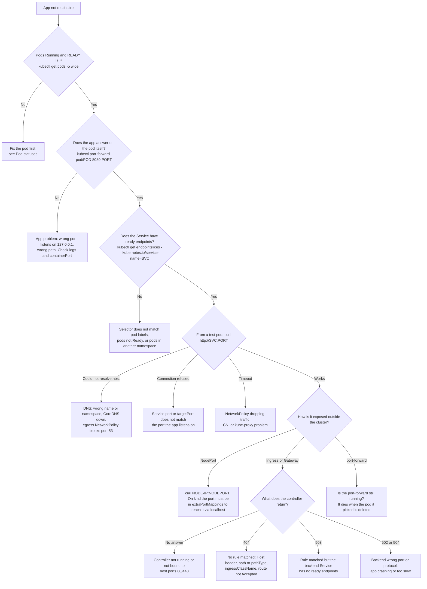

# Troubleshooting guide

Start from what you **see**. Each symptom gives you the likely causes, the
exact commands that confirm the cause, and the fix. The error messages
quoted here were produced on a kind cluster running Kubernetes v1.37, the
version this course targets, unless they are marked *typical*. A *typical* message comes from an
environment kind can't reproduce, such as cloud block storage or a private
registry.

Add `-n <namespace>` to every command, or set a default namespace (see the
[cheatsheet](kubectl-cheatsheet.md#2-contexts-and-namespaces)). For the
hands-on version of this page, see [module 16 (Debugging)](../modules/16-debugging/README.md),
which has 8 broken apps for you to fix.

## Contents

* [The first five commands](#the-first-five-commands)
* [Reading STATUS and exit codes](#reading-status-and-exit-codes)
* Pods: [Pending](#pending) · [ContainerCreating / Init](#containercreating-and-init) ·
  [ImagePullBackOff / ErrImagePull](#imagepullbackoff--errimagepull) ·
  [CrashLoopBackOff](#crashloopbackoff) · [CreateContainerConfigError](#createcontainerconfigerror) ·
  [Running but not Ready](#running-but-not-ready) · [OOMKilled](#oomkilled) ·
  [Evicted](#evicted) · [Terminating forever](#terminating-forever) ·
  [Completed when you expected Running](#completed-when-you-expected-running) ·
  [No pods at all](#deployment-shows-03-and-there-are-no-pods-at-all)
* [My app isn't reachable (flowchart)](#my-app-isnt-reachable)
* Services: [no endpoints](#service-has-no-endpoints) · [connection refused](#connection-refused) ·
  [timeouts](#timeouts) · [DNS failures](#dns-failures)
* Storage: [PVC Pending](#pvc-pending) · [Multi-Attach error](#multi-attach-error-volume-is-already-exclusively-attached-to-one-node) ·
  [mount timeouts](#mount-timeouts-failedmount) · [PV Released](#pv-released-cant-be-reused) ·
  [PVC stuck Terminating](#pvc-stuck-terminating)
* Nodes: [NotReady](#node-notready) · [DiskPressure](#diskpressure-and-other-pressure-conditions)
* [Ingress / Gateway 404, 503, 502](#ingress-and-gateway-404-503-502)
* [RBAC: Forbidden](#rbac-forbidden) (and Forbidden errors that are *not* RBAC)

---

## The first five commands

Run these before you change anything. Most problems are explained by the
`Events:` section at the bottom of `describe`.

```bash
kubectl get pods -o wide                          # STATUS, RESTARTS, NODE, IP
kubectl describe pod <pod>                        # Conditions, container State/Last State, Events
kubectl events --for pod/<pod>                    # just the events, with (xN over T) counts
kubectl logs <pod> [-c <container>] --previous    # output of the LAST crashed instance
kubectl get pod <pod> -o yaml                     # status.conditions, containerStatuses[].state/lastState
```

Events are only kept for about an hour (the API server default), so look
soon after the problem. `kubectl events -A --types=Warning` gives you a
quick view of the whole cluster.

## Reading STATUS and exit codes

The `STATUS` column of `kubectl get pods` is **not** the pod's phase. kubectl
builds it from the phase (`Pending`, `Running`, `Succeeded`, `Failed`,
`Unknown`), the pod's `.status.reason` and the containers' states. That is
why you see values such as `Init:0/1`, `PodInitializing`,
`CrashLoopBackOff`, `Completed` or `Error`. To get the real phase, run
`kubectl get pod <pod> -o jsonpath='{.status.phase}'`.

`describe` shows a container's last exit code under `Last State: Terminated`:

| Exit code | Meaning |
|---|---|
| 0 | The process finished successfully (`Completed`). For a long-running app this is a bug. See [Completed when you expected Running](#completed-when-you-expected-running). |
| 1, 2, … | The application reported an error. Read `kubectl logs --previous`. |
| 126 / 127 | Shell convention: command found but not executable / command not found. |
| 128 with reason `StartError` | The runtime could not start the process at all, e.g. the `command` binary is not in the image. STATUS shows `RunContainerError`. |
| 137 (128+9, SIGKILL) | Reason `OOMKilled`: the memory limit was exceeded. Otherwise the container was killed after its grace period, or a failed liveness probe restarted it. |
| 139 (128+11) | Segmentation fault. |
| 143 (128+15, SIGTERM) | The process stopped cleanly on SIGTERM. |

---

## Pod statuses

### Pending

**What it means.** Usually that the pod has not been scheduled yet:
`.spec.nodeName` is empty and you'll see a `FailedScheduling` event. Once a
pod is scheduled but still preparing, STATUS shows `ContainerCreating` or
`Init:…` instead.

**Read the scheduler's message.** It accounts for every node. For example
`0/3 nodes are available: 1 node(s) had untolerated taint(s), 2 Insufficient cpu.`
means one node is excluded by a taint and the other two lack CPU. (Older
versions also name the taint, e.g.
`had untolerated taint {node-role.kubernetes.io/control-plane: }`.)

| Message (real, from kind) | Cause | Fix |
|---|---|---|
| `2 Insufficient cpu` / `Insufficient memory` | The pod's **requests** don't fit in what is still unrequested on any node. Usage is irrelevant: the scheduler counts requests, not live consumption. | Lower requests, free capacity, or add nodes. Compare with `kubectl describe node <n>` → *Allocated resources*. |
| `node(s) didn't match Pod's node affinity/selector` | A `nodeSelector` or required node affinity matches no node, often a typo in the label. | `kubectl get nodes --show-labels`; fix the label or the selector ([module 10](../modules/10-scheduling/README.md)). |
| `node(s) had untolerated taint(s)` | Taint without a toleration. List the taints with the `custom-columns` command below. kind's control-plane node always has `node-role.kubernetes.io/control-plane:NoSchedule`, which is why it shows up in almost every message. | Add a toleration, or schedule somewhere else. |
| `didn't match pod anti-affinity rules` / `didn't match pod topology spread constraints` | Not enough nodes or zones to satisfy *required* anti-affinity or `DoNotSchedule` spread. | More nodes, `preferred…` rules, or `whenUnsatisfiable: ScheduleAnyway`. |
| `pod has unbound immediate PersistentVolumeClaims` | The PVC cannot bind (bad StorageClass, no matching PV). | See [PVC Pending](#pvc-pending). |
| `persistentvolumeclaim "x" not found` | The pod references a claim that doesn't exist in its namespace. | Create the PVC or fix `claimName`. |
| `node(s) didn't match PersistentVolume's node affinity` | The volume is node-local (kind's local-path, `local` PVs) and lives on a different node than the one the pod is forced onto. | Let the pod go to the volume's node, or use network storage. |
| `node(s) unavailable due to PersistentVolumeClaim with ReadWriteOncePod access mode already in-use by another pod` (older versions: `node has pod using PersistentVolumeClaim with the same name and ReadWriteOncePod access mode`) | A `ReadWriteOncePod` claim is already in use by another pod. This is working as designed. | Wait for, or delete, the other pod ([scenario](../scenarios/rwo-pvc-ordered-pods/README.md)). |
| *No events at all* | The scheduler isn't running, or `spec.schedulerName` names a scheduler that doesn't exist. | `kubectl get pods -n kube-system` (look for `kube-scheduler-*`). |

```bash
kubectl describe pod <pod> | sed -n '/Events:/,$p'
kubectl get pod <pod> -o jsonpath='{.spec.nodeName}'          # empty = not scheduled
kubectl describe node <node> | grep -A8 'Allocated resources'
kubectl get nodes -o custom-columns=NAME:.metadata.name,TAINTS:.spec.taints
kubectl get pod <pod> -o yaml | grep -A10 -E 'nodeSelector|affinity|tolerations'
```

The `preemption: …` part of the message tells you whether evicting
lower-priority pods could help (see PriorityClass in
[module 10](../modules/10-scheduling/README.md)).

### ContainerCreating and Init

**What it means.** The pod is scheduled, and the kubelet on that node is
still pulling images, mounting volumes or setting up the pod's network
sandbox. `Init:0/2` means that init container 1 of 2 hasn't finished yet.
`Init:CrashLoopBackOff` and `Init:Error` mean an init container is failing.

| Event | Cause | Fix |
|---|---|---|
| `MountVolume.SetUp failed for volume "cfg" : configmap "missing-cm" not found` (real) | ConfigMap or Secret used as a **volume** doesn't exist. | Create it (the kubelet retries by itself) or set `optional: true`. |
| `FailedAttachVolume` / `FailedMount` | Storage attach or mount problem. | See [Multi-Attach](#multi-attach-error-volume-is-already-exclusively-attached-to-one-node) and [mount timeouts](#mount-timeouts-failedmount). |
| `Failed to create pod sandbox: … failed to setup network …` (*typical*) | CNI plugin not running or misconfigured on that node. | `kubectl get pods -n kube-system -o wide` (kindnet / calico / cilium pods on that node). |
| Only `Pulling image …` for a long time | Large image or slow registry. | Wait, or pre-pull (`kind load docker-image` on kind). |

```bash
kubectl describe pod <pod> | sed -n '/Events:/,$p'
kubectl logs <pod> -c <init-container-name>         # init containers have logs too
kubectl get pod <pod> -o jsonpath='{.status.initContainerStatuses[*].state}'
```

### ImagePullBackOff / ErrImagePull

**What it means.** `ErrImagePull` is shown when the pull has just failed;
`ImagePullBackOff` is shown while the kubelet waits before the next try.
The waits grow longer each time, up to 5 minutes. The real reason is in
the event `Failed to pull image "...": ...`.

| Message contains (*typical*, containerd) | Cause |
|---|---|
| `not found` / `manifest unknown` | Typo in the image name or tag, or the tag was never pushed. |
| `pull access denied`, `401 Unauthorized`, `authorization failed` | Private registry and no (or wrong) `imagePullSecrets`. Docker Hub also returns this for repositories that don't exist. |
| `429 Too Many Requests` / `toomanyrequests` | Docker Hub rate limit. Authenticate or use a mirror. |
| `dial tcp …: i/o timeout`, `no such host`, `proxyconnect tcp` | The **node** can't reach the registry (DNS, proxy, firewall). |
| `no match for platform in manifest` | The image has no build for the node's CPU architecture (e.g. amd64-only image on an arm64 Mac). |

```bash
kubectl describe pod <pod> | grep -A3 'Failed'
kubectl get pod <pod> -o jsonpath='{.status.containerStatuses[*].state.waiting.message}'
kubectl get pod <pod> -o jsonpath='{.spec.containers[*].image} {.spec.imagePullSecrets}'
kubectl get sa <serviceaccount> -o jsonpath='{.imagePullSecrets}'   # pull secrets can come from the SA
docker pull <image>                                                 # does it pull from your machine?
```

**Fixes.**

* Correct the image reference. Pin a real tag; never rely on `:latest`.
* For a private registry: `kubectl create secret docker-registry regcred --docker-server=… --docker-username=… --docker-password=…`,
  then reference it from the pod (`spec.imagePullSecrets`) or attach it to
  the ServiceAccount.
* **kind and locally built images:** the nodes can't see your local Docker
  images. Run `kind load docker-image myapp:1.0 --name kube-training` and use
  `imagePullPolicy: IfNotPresent`. A `:latest` tag, or no tag at all,
  defaults to `Always`, which tries to pull from a registry.

### CrashLoopBackOff

**What it means.** The container started, exited, and keeps being
restarted. The kubelet waits 10s, 20s, 40s and so on between restarts, up
to 5 minutes, and resets the back-off once the container has run fine for
10 minutes. `CrashLoopBackOff` is **not the cause**: look at `Last State`.

```bash
kubectl logs <pod> -c <container> --previous      # what did it print before dying?
kubectl describe pod <pod> | grep -A8 'Last State'
#    Last State:  Terminated
#      Reason:    Error          <- or OOMKilled, Completed, StartError
#      Exit Code: 1
kubectl get pod <pod> -o jsonpath='{.status.containerStatuses[0].lastState.terminated}'
kubectl events --for pod/<pod> | grep -iE 'liveness|kill'
```

| Clue | Cause | Fix |
|---|---|---|
| Logs show a stack trace or config error | The app is failing: missing env var, bad config file, can't reach its database. | Fix the config. Make the app wait or retry for its dependencies instead of exiting. |
| `Last State: Terminated, Reason: Completed, Exit Code: 0` | The main process **finished**. | See [Completed when you expected Running](#completed-when-you-expected-running). |
| `Reason: OOMKilled, Exit Code: 137` | The memory limit was exceeded. | See [OOMKilled](#oomkilled). |
| Events: `Liveness probe failed … Container … will be restarted` | The liveness probe kills a healthy but slow app (too short `initialDelaySeconds`, `timeoutSeconds` (default 1s), wrong path or port). | Add a `startupProbe`, relax the thresholds, fix the path ([module 01](../modules/01-pods/README.md)). |
| STATUS `RunContainerError`, `Reason: StartError, Exit Code: 128`, event `exec: "/bin/doesnotexist": stat /bin/doesnotexist: no such file or directory` (real) | `command` points at a binary that isn't in the image (common with distroless/alpine: no `bash`). | Fix `command`/`args`. Remember `command` replaces the image ENTRYPOINT and `args` replaces CMD. |
| `permission denied`, `read-only file system` in logs | securityContext (non-root, `readOnlyRootFilesystem`) conflicts with what the image expects. | Mount an `emptyDir` for writable paths and fix file ownership ([module 15](../modules/15-security/README.md)). |

To poke around inside a container that crashes too fast to `exec` into,
start a copy with its command replaced by a shell:

```bash
kubectl debug <pod> -it --copy-to=<pod>-debug --container=<container> --profile=general -- sh
# ...run the original entrypoint by hand, inspect files and env...
kubectl delete pod <pod>-debug
```

### CreateContainerConfigError

**What it means.** The image is there, but the kubelet can't build the
container's configuration. The kubelet keeps retrying, so **once you create
the missing object the pod starts on its own**. You don't need to delete
it; this was verified on the course cluster.

| Event (real) | Cause | Fix |
|---|---|---|
| `Error: configmap "missing-cm" not found` | `env`/`envFrom` refers to a missing ConfigMap. The same happens for Secrets. | Create it in the **pod's namespace**, or mark the reference `optional: true`. |
| `Error: couldn't find key username in Secret lab-cheatsheet/db` | The object exists but the key doesn't. | `kubectl get secret db -o jsonpath='{.data}'` to see the real keys. |
| `Error: container has runAsNonRoot and image will run as root` | `runAsNonRoot: true`, but the image's user is root (UID 0) and no `runAsUser` is set. | Set `runAsUser: <non-zero UID>` or use an image that runs as non-root. |

```bash
kubectl describe pod <pod> | grep -B1 -A2 'Error:'
kubectl get cm,secret                     # does it exist in THIS namespace?
```

### Running but not Ready

**What it means.** STATUS is `Running` but READY is `0/1`. The container is
up, but its **readiness probe** fails, a startup probe hasn't passed yet,
or a readiness gate is false. A pod that isn't Ready is marked
`ready: false` in its Service's EndpointSlice and **gets no Service
traffic**. Kubernetes leaves it running, though; only liveness failures
restart containers.

```bash
kubectl describe pod <pod> | grep -E 'Readiness|Unhealthy'
#   Warning  Unhealthy  Readiness probe failed: HTTP probe failed with statuscode: 404   (real)
kubectl get pod <pod> -o jsonpath='{range .status.conditions[*]}{.type}={.status} {end}'
#   ... Ready=False ContainersReady=False ...
kubectl get endpointslices -l kubernetes.io/service-name=<svc> -o yaml | grep -A4 conditions
kubectl exec <pod> -- wget -qO- -T 2 http://localhost:<port><path>   # test the probe target yourself
```

**Usual causes:** wrong probe `path`, `port` or `scheme`; the app is
listening on a different port; the app is slow to start (add a
`startupProbe`); `timeoutSeconds` (default 1s) is too short; or the probe
checks a dependency that is down, which can take every replica out of
service at once. Keep readiness checks local.

### OOMKilled

**What it means.** The container used more memory than `limits.memory` and
the kernel's OOM killer killed it. STATUS briefly shows `OOMKilled`, then
`CrashLoopBackOff`. Real output from `describe`:

```
    Last State:     Terminated
      Reason:       OOMKilled
      Exit Code:    137
    Limits:
      memory:  32Mi
```

```bash
kubectl get pod <pod> -o jsonpath='{.status.containerStatuses[*].lastState.terminated.reason}'
kubectl top pod <pod> --containers           # needs metrics-server (module 14)
kubectl get pod <pod> -o jsonpath='{.spec.containers[*].resources}'
kubectl events -A --types=Warning | grep -i oom   # node-level OOM shows up as SystemOOM on the Node
```

**Fixes:** measure real usage and set the limit above its peak, with the
request close to normal usage. Fix the leak, or make the runtime respect
the limit (e.g. JVM `-XX:MaxRAMPercentage`, Node.js `--max-old-space-size`).
CPU limits never cause OOMKilled; too little CPU **throttles** the
container instead. Pods with no memory limit can also be killed when the
**node** runs out of memory. BestEffort pods go first, then Burstable
([QoS classes](glossary.md#qos-class)).

### Evicted

**What it means.** The kubelet stopped the pod to protect the node. Either
the node was short of memory, disk or PIDs, or the pod went over its own
`ephemeral-storage` limit. The pod object stays around with phase `Failed`
and `.status.reason: Evicted`.

> On current versions (verified on 1.37 and 1.33) the STATUS column shows **`Error`**, not `Evicted`.
> It shows the container's termination reason. Check `describe` instead.
> Real output:
>
> ```
> Status:   Failed
> Reason:   Evicted
> Message:  Pod ephemeral local storage usage exceeds the total limit of containers 20Mi.
> ```

```bash
kubectl get pods -A --field-selector=status.phase=Failed
kubectl get pod <pod> -o jsonpath='{.status.reason}: {.status.message}'
kubectl describe node <node> | sed -n '/Conditions:/,/Addresses:/p'   # MemoryPressure / DiskPressure / PIDPressure
kubectl get events -A --field-selector reason=Evicted
```

**Fixes:** set requests that match real usage. Under node pressure, the
kubelet first evicts pods whose usage exceeds their requests, ranked by
priority and by how far over they are. Set `ephemeral-storage` requests
and limits for pods that write to their container filesystem or to
`emptyDir`. Free disk space on the node (see
[DiskPressure](#diskpressure-and-other-pressure-conditions)). A Deployment
replaces evicted pods, but the old `Failed` objects remain until you delete
them: `kubectl delete pods -A --field-selector=status.phase=Failed`.

`kubectl drain` also "evicts", but through the Eviction API: those pods are
deleted, respecting PodDisruptionBudgets, and don't stay behind as
`Evicted`.

### Terminating forever

**What it means.** The pod has a `deletionTimestamp` but the object is
still there. A normal delete takes up to `terminationGracePeriodSeconds`
(30s by default), plus any `preStop` hook time. If it takes much longer,
something is holding it.

```bash
kubectl get pod <pod> -o jsonpath='{.metadata.deletionTimestamp}{"  "}{.metadata.finalizers}{"  "}{.spec.nodeName}{"\n"}'
kubectl get node <node>                       # NotReady / Unknown?
kubectl describe pod <pod> | sed -n '/Events:/,$p'
```

| Clue | Cause | Fix |
|---|---|---|
| `finalizers` is non-empty, e.g. `["example.com/block-delete"]` | A **finalizer** is waiting for a controller to finish cleanup. If that controller is gone, it never will. Once its containers stop, the pod may show `Completed` or `Error` instead of `Terminating`, but the object still doesn't go away (verified on 1.37). | Fix or reinstall the controller. Only if you are sure no cleanup is needed: `kubectl patch pod <pod> --type=json -p '[{"op":"remove","path":"/metadata/finalizers"}]'` |
| Node is `NotReady` / `Unknown` | The kubelet can't confirm that the containers stopped, so the API server keeps the object. | Bring the node back, or delete the Node object. For a node that is really powered off, add the `node.kubernetes.io/out-of-service=nodeshutdown:NoExecute` taint (non-graceful shutdown). |
| App ignores SIGTERM | It waits out the full grace period, then gets SIGKILL. It is slow but not stuck. | Handle SIGTERM, or lower `terminationGracePeriodSeconds`. |

`kubectl delete pod <pod> --grace-period=0 --force` removes the **API
object** without waiting for the kubelet. If the node is in fact still
running, the container keeps running too. For a StatefulSet that can mean
**two pods with the same identity writing to the same volume**. Use it only
when you know the node is dead.

A **namespace** stuck in `Terminating`: run `kubectl get ns <ns> -o yaml`
and read `status.conditions`. They name the leftover resources or
finalizers. A common cause is an aggregated API that no longer responds,
e.g. a broken metrics-server (`kubectl get apiservices | grep False`).

### Completed when you expected Running

**What it means.** The container's main process exited with code 0. A
standalone pod with `restartPolicy: Never` or `OnFailure` then shows
`Completed`. Under a Deployment (`restartPolicy: Always`) it is restarted
over and over. STATUS alternates between `Completed` and
`CrashLoopBackOff`, and `describe` shows
`Last State: Terminated, Reason: Completed, Exit Code: 0` (verified).

**Usual causes:**

* The command does its work and exits: `echo`, a migration script, a
  shell script whose last line doesn't start the server.
* The server **daemonizes**, i.e. forks into the background so PID 1
  exits. Run it in the foreground, e.g. `nginx -g 'daemon off;'`.
* `command:` replaced the image's ENTRYPOINT with something that finishes.
  Check `kubectl get pod <pod> -o jsonpath='{.spec.containers[0].command} {.spec.containers[0].args}'`
  and compare with `docker inspect <image>`.
* It is supposed to finish, in which case it should be a
  [Job](../modules/08-jobs-cronjobs/README.md), not a Deployment.

### Deployment shows 0/3 and there are no pods at all

Pods that are **rejected at creation** never appear. The error is recorded
on the **ReplicaSet** (or Job, StatefulSet, DaemonSet), not on a pod:

```bash
kubectl describe rs -l app=<app> | sed -n '/Events:/,$p'
kubectl get events --field-selector reason=FailedCreate
```

Real examples:

```
Error creating: pods "quota-deploy-86d86fcffc-6dqcl" is forbidden: failed quota: q: must specify limits.memory for: busybox; requests.cpu for: busybox
pods "psa-test" is forbidden: violates PodSecurity "restricted:latest": allowPrivilegeEscalation != false (container "psa-test" must set securityContext.allowPrivilegeEscalation=false), unrestricted capabilities (...), runAsNonRoot != true (...), seccompProfile (...)
```

The fixes are in [module 02 (ResourceQuota/LimitRange)](../modules/02-namespaces-labels/README.md)
and [module 15 (Pod Security Admission)](../modules/15-security/README.md).

---

## My app isn't reachable

Work from the inside out: pod → Service → DNS → the way it is exposed. Each
step uses a test pod *inside* the cluster, so you know which layer is
broken.



The test pods used throughout this section:

```bash
kubectl run tmp --rm -i --restart=Never --image=curlimages/curl:8.11.1 -- curl -sS -m 3 http://<svc>:<port>/
kubectl run tmp --rm -i --restart=Never --image=nicolaka/netshoot:v0.13 -- dig +short <svc>.<ns>.svc.cluster.local
kubectl run tmp --rm -i --restart=Never --image=nicolaka/netshoot:v0.13 -- nc -zv -w 2 <svc> <port>
```

## Services

### Service has no endpoints

```bash
kubectl get endpointslices -l kubernetes.io/service-name=web-badsel -o wide
#   NAME               ADDRESSTYPE   PORTS     ENDPOINTS   AGE
#   web-badsel-nl4cv   IPv4          <unset>   <unset>     1s          (real)
kubectl get svc <svc> -o jsonpath='{.spec.selector}'      # what the Service looks for
kubectl get pods --show-labels                            # what the pods actually have
kubectl get pods -l app=<value-from-selector>             # does the selector match anything?
```

* **Selector doesn't match the pod labels.** This is the most common cause
  (a typo such as `app: wbe`, or a label only on the Deployment and not on
  its pod template).
* **Pods exist but aren't Ready.** They are listed with `ready: false`.
  See [Running but not Ready](#running-but-not-ready).
* **Pods are in another namespace.** A Service only selects pods in its own
  namespace.
* **A Service without a selector** never gets endpoints automatically
  (intended for external backends). You manage its EndpointSlices yourself.

> `kubectl get endpoints` still works but prints
> `Warning: v1 Endpoints is deprecated in v1.33+; use discovery.k8s.io/v1 EndpointSlice`.

### Connection refused

On the course cluster (kube-proxy in iptables mode), **both** of these fail
instantly with `curl: (7) Failed to connect to <svc> port 80 after 2 ms: Could not connect to server`
(older curl versions say `Connection refused`):

1. **No ready endpoints.** kube-proxy actively rejects traffic to a Service
   with no endpoints, so you get "refused", not a timeout.
2. **Wrong `targetPort`.** Traffic reaches the pod, but nothing listens on
   that port.

Other causes: the app listens only on `127.0.0.1` (it works with `exec` +
`localhost` but not via the pod IP); a named `targetPort` (e.g. `http`)
that doesn't match any `containerPort` name.

```bash
kubectl get svc <svc> -o jsonpath='{.spec.ports}'            # port -> targetPort
kubectl get pod <pod> -o jsonpath='{.spec.containers[*].ports}'
kubectl exec <pod> -- netstat -tln                           # what is really listening (busybox/alpine; ignore a tcp6 warning)
kubectl get pod <pod> -o jsonpath='{.status.podIP}'
kubectl run tmp --rm -i --restart=Never --image=curlimages/curl:8.11.1 -- curl -sS -m 3 http://<podIP>:<port>/
#   pod IP works but Service fails -> Service ports;   pod IP fails too -> the app
```

### Timeouts

A timeout, rather than a refusal, usually means packets are being
**dropped**. The likely causes are a NetworkPolicy (check for a default-deny in the
client's or the server's namespace: `kubectl get netpol -A`), a CNI or
kube-proxy problem on one node (does it fail only from some nodes?), or an
app that accepts connections but never answers. See
[module 13](../modules/13-network-policies/README.md).

### DNS failures

```bash
# real output for a wrong namespace:
#   curl: (6) Could not resolve host: web.wrong-ns
#   ** server can't find web.wrong-ns.svc.cluster.local: NXDOMAIN
kubectl run dns --rm -i --restart=Never --image=busybox:1.37 -- nslookup kubernetes.default.svc.cluster.local
#   (use full names with busybox nslookup: it ignores the search domains, so a short name
#    such as kubernetes.default fails with NXDOMAIN even when DNS works; netshoot's dig is better)
kubectl exec <pod> -- cat /etc/resolv.conf       # search <ns>.svc.cluster.local svc.cluster.local cluster.local; ndots:5
kubectl get pods -n kube-system -l k8s-app=kube-dns -o wide
kubectl logs -n kube-system -l k8s-app=kube-dns --tail=20
kubectl get svc -n kube-system kube-dns          # 10.96.0.10 on kind
```

* **Wrong name.** Use `<svc>` from the same namespace, and
  `<svc>.<namespace>` or `<svc>.<namespace>.svc.cluster.local` from
  anywhere else. Individual StatefulSet pods are
  `<pod>.<headless-svc>.<ns>.svc.cluster.local`.
* **The name resolves but the connection fails.** DNS is fine; go back to
  the Service checks.
* **Nothing resolves.** CoreDNS is down, or an **egress NetworkPolicy
  doesn't allow UDP and TCP port 53** to kube-system. This often happens
  right after you add a default-deny egress policy.
* Pods with `hostNetwork: true` need `dnsPolicy: ClusterFirstWithHostNet`
  to use cluster DNS.

---

## Storage

### PVC Pending

```bash
kubectl describe pvc <pvc> | sed -n '/Events:/,$p'
kubectl get sc                    # standard (default) rancher.io/local-path  WaitForFirstConsumer
kubectl get pv
kubectl get pods -n local-path-storage; kubectl logs -n local-path-storage deploy/local-path-provisioner --tail=20   # kind
```

| Event (real, from kind) | Cause | Fix |
|---|---|---|
| `WaitForFirstConsumer … waiting for first consumer to be created before binding` | **Normal.** The StorageClass delays provisioning until a pod using the claim is scheduled, so the volume is created where the pod runs. | Create the pod. |
| `ProvisioningFailed … storageclass.storage.k8s.io "fast" not found` | The StorageClass name is wrong or doesn't exist. | `kubectl get sc`; fix `storageClassName`. It is immutable, so delete and recreate the PVC. |
| `NodePath only supports ReadWriteOnce and ReadWriteOncePod (1.22+) access modes` | The provisioner can't provide the requested access mode (local-path has no RWX). | Use an RWX-capable class (NFS, CephFS, a cloud file service), or rethink the design ([module 06](../modules/06-storage/README.md)). |
| `Waiting for a volume to be created either by the external provisioner … or manually` with no other events | The provisioner or CSI controller isn't running. | Check its pods and logs. |
| No events, `storageClassName: ""` | Static binding: no PV matches size, access modes, `storageClassName`, `volumeMode` or selector. | Create a matching PV, or set a StorageClass. |

### Multi-Attach error: "Volume is already exclusively attached to one node"

```
Warning  FailedAttachVolume  attachdetach-controller  Multi-Attach error for volume "pvc-3f1c…" Volume is already exclusively attached to one node and can't be attached to another
Warning  FailedAttachVolume  attachdetach-controller  Multi-Attach error for volume "pvc-3f1c…" Volume is already used by pod(s) app-6d5f9c7b8-x2k4q
Warning  FailedMount         kubelet                  Unable to attach or mount volumes: unmounted volumes=[data], unattached volumes=[data]: timed out waiting for the condition
```

(*Typical* messages. The exact wording of the last line varies by version.)

**What it means.** `ReadWriteOnce` means *one node* at a time, not one pod.
A new pod landed on **node B** while the volume is still attached to
**node A** (where another pod uses it, or recently used it). Block storage
can only be attached to one machine, so the attach/detach controller
refuses and the new pod sits in `ContainerCreating`. Several pods on the
**same** node can share an RWO volume without trouble.

You'll only see this with **attachable** volumes: AWS EBS, GCE PD, Azure
Disk, Ceph RBD, vSphere, iSCSI and most cloud CSI drivers. **On kind you
won't see it.** local-path volumes are node-local directories with node
affinity, so the scheduler simply won't place the second pod on another
node. That pod stays `Pending` with
`didn't match PersistentVolume's node affinity`, while a pod on the same
node mounts the RWO volume next to the first one. Both behaviours were
verified on the course cluster.

**Common causes**

1. A **Deployment with `replicas > 1`** sharing one RWO PVC, with pods
   spread over several nodes.
2. A Deployment with **`strategy: RollingUpdate`** and an RWO PVC. The new
   pod is created *before* the old one is removed (`maxSurge`) and may land
   on another node. It can't attach, never becomes Ready, so the old pod is
   never removed and the rollout hangs.
3. **Node failure.** The old pod is stuck `Terminating` on a dead node, and
   the volume stays attached until the attach/detach controller gives up
   waiting (several minutes) or you mark the node out of service.
4. A short-lived overlap that clears up on its own: the old pod was just
   deleted and the detach hasn't finished.
5. Overlapping **Job/CronJob** runs (`concurrencyPolicy: Allow`) that land
   on different nodes.

**Confirm**

```bash
kubectl describe pod <new-pod> | sed -n '/Events:/,$p'               # FailedAttachVolume / FailedMount
kubectl get pvc <claim> -o jsonpath='{.spec.volumeName} {.spec.accessModes}{"\n"}'
# every pod that uses the claim, and its node:
kubectl get pods -A -o jsonpath='{range .items[*]}{.metadata.namespace}/{.metadata.name}{"\t"}{.spec.nodeName}{"\t"}{.spec.volumes[*].persistentVolumeClaim.claimName}{"\n"}{end}' | grep -w <claim>
kubectl get volumeattachments | grep <pv-name>       # CSI: which node the volume is attached to right now
kubectl get nodes                                    # is the old node NotReady?
kubectl get deploy <name> -o jsonpath='{.spec.replicas} {.spec.strategy}{"\n"}'
```

**Fixes**, from the most to the least common:

| Situation | Fix |
|---|---|
| A single writer, e.g. a database in a Deployment | `replicas: 1` **and** `strategy: type: Recreate` (the old pod is gone before the new one starts). Better still, use a StatefulSet. |
| Each replica needs its own data | StatefulSet with `volumeClaimTemplates`: one PVC per pod ([module 07](../modules/07-statefulsets/README.md)). |
| Several pods really must share files | RWX storage (NFS, CephFS, EFS, Azure Files, Filestore), or put the pods on the **same node** with pod affinity. RWO allows that. |
| Exactly one pod may ever use the volume | `ReadWriteOncePod`. A second pod then waits in `Pending` with a clear message instead of a Multi-Attach error. |
| The old node is dead | Wait for the force-detach, or (if the node is really off) add the `node.kubernetes.io/out-of-service=nodeshutdown:NoExecute` taint so its pods are deleted and their volumes detached. Never force-detach a volume that a still-running node might be writing to. |
| Pod B must start only after pod A, both on one RWO volume | See the scenario below. |

**Full worked answer, with four tested patterns:**
[`scenarios/rwo-pvc-ordered-pods`](../scenarios/rwo-pvc-ordered-pods/README.md).
It covers one RWO volume, two pods in a fixed order, and a Service in front.

### Mount timeouts (FailedMount)

`Unable to attach or mount volumes: … timed out waiting for the condition`
(newer versions may say `context deadline exceeded`) means the kubelet gave
up waiting for a volume. It keeps retrying.

| Cause | Check |
|---|---|
| The attach never finished: Multi-Attach, or the CSI attacher is down | `kubectl get volumeattachments`, `kubectl describe pod` (an earlier `FailedAttachVolume`?) |
| The CSI **node** plugin isn't running on that node | `kubectl get csidrivers`, `kubectl get csinodes`, `kubectl get pods -A -o wide \| grep csi` |
| NFS/SMB server unreachable, wrong export, or the node lacks client tools (`nfs-common`) | Events mention `mount.nfs: …`; try the mount from the node |
| Huge volume with `fsGroup`: the kubelet changes the owner of every file recursively | `securityContext.fsGroupChangePolicy: OnRootMismatch` |
| ConfigMap or Secret volume missing | Event `configmap "…" not found` (see [ContainerCreating](#containercreating-and-init)) |

On kind, the node's kubelet log is one command away:
`docker exec kube-training-worker journalctl -u kubelet --no-pager | grep -i mount | tail`.

### PV Released, can't be reused

With `persistentVolumeReclaimPolicy: Retain`, deleting the PVC leaves the PV
`Released`. It still points to the old claim through `spec.claimRef`, so a
new PVC can't bind to it. Verified sequence:

```bash
kubectl get pv lab-cheatsheet-pv
#   STATUS: Released   CLAIM: lab-cheatsheet/manual
kubectl describe pvc manual          # (the new claim)
#   Warning  FailedBinding  volume "lab-cheatsheet-pv" already bound to a different claim.
# 1. back up / clean the data on the volume if needed, then:
kubectl patch pv lab-cheatsheet-pv --type=json -p '[{"op":"remove","path":"/spec/claimRef"}]'
#   STATUS: Available  -> the new PVC binds
```

With `Delete` (the default for dynamically provisioned volumes, including
kind's `standard`), deleting the PVC **deletes the PV and the data**. To
keep a volume you care about, switch its policy before you delete the
claim:
`kubectl patch pv <pv> -p '{"spec":{"persistentVolumeReclaimPolicy":"Retain"}}'`.

### PVC stuck Terminating

The `kubernetes.io/pvc-protection` finalizer stops a PVC from being deleted
while any pod still uses it. This is intended. Find the pods with the
"every pod that uses the claim" command
[above](#multi-attach-error-volume-is-already-exclusively-attached-to-one-node)
and delete them (or their controller). Completed Job pods count as users
too.

---

## Nodes

### Node NotReady

```bash
kubectl get nodes -o wide
kubectl describe node <node> | sed -n '/Conditions:/,/Addresses:/p'   # Ready=False/Unknown + Message
kubectl get pods -n kube-system -o wide --field-selector spec.nodeName=<node>   # CNI + kube-proxy pods there
# on the node itself (on kind, every node is a container):
docker exec <node> systemctl status kubelet containerd --no-pager
docker exec <node> journalctl -u kubelet --no-pager --since "-10min" | tail -50
docker exec <node> crictl ps -a
kubectl debug node/<node> -it --image=busybox:1.37 --profile=sysadmin -n <some-ns>  # if the kubelet still runs pods
```

| Condition message / symptom (*typical*) | Cause |
|---|---|
| `Kubelet stopped posting node status`, status `Unknown` | The kubelet is dead or can't reach the API server (network, expired client certificate, clock skew). |
| `container runtime network not ready: NetworkReady=false reason:NetworkPluginNotReady … cni plugin not initialized` | The CNI isn't installed or its pod on that node is crashing. |
| `container runtime is down` / `PLEG is not healthy` | containerd is broken or overloaded. |
| `MemoryPressure`, `DiskPressure` or `PIDPressure` = True | The node is short of resources (next section). |

When a node stops reporting, the node controller taints it
`node.kubernetes.io/unreachable:NoExecute` (or `node.kubernetes.io/not-ready:NoExecute`
when the kubelet reports `Ready=False`). Pods carry default
tolerations for both taints (`tolerationSeconds: 300`; you can see it in
every `kubectl describe pod`), so their controllers replace them on other
nodes about **5 minutes** later. StatefulSet pods are **not** replaced
automatically while the old pod may still be running. That protects the
"at most one pod per identity" guarantee.

On kind: `docker ps` (is the node container running?), then
`docker restart kube-training-worker`.

### DiskPressure (and other pressure conditions)

The kubelet sets `DiskPressure=True` when free space or inodes on the node
filesystem (`nodefs`) or the image filesystem (`imagefs`) drop below its
eviction thresholds. The defaults are roughly `nodefs.available<10%`,
`imagefs.available<15%` and `nodefs.inodesFree<5%`. The node is then
tainted `node.kubernetes.io/disk-pressure:NoSchedule`, unused images are
garbage-collected, and pods are evicted, starting with the ones using the
most local storage beyond their requests.

```bash
kubectl describe node <node> | grep -E 'DiskPressure|Taints'
kubectl get events -A --field-selector reason=Evicted
docker exec <node> df -h /var/lib/containerd /var    # kind; on a VM: ssh + df -h, df -i
docker exec <node> crictl images
docker exec <node> crictl rmi --prune                # remove unused images on that node
docker system df                                     # kind: all nodes share YOUR machine's Docker disk
```

**Fixes:** free disk space (on kind, `docker system prune` on the host),
set `ephemeral-storage` limits on pods that write a lot, ship logs
somewhere instead of writing huge files inside containers, or get a bigger
disk. The other conditions follow the same pattern: `MemoryPressure` (see
[OOMKilled](#oomkilled) and [Evicted](#evicted)) and `PIDPressure` (a fork
bomb or a thread leak; set `pids` limits).

---

## Ingress and Gateway: 404, 503, 502

The **controller** produces these responses, not Kubernetes itself. The
exact pages differ between controllers; the meanings below hold for the
common ones (ingress-nginx, Traefik, Envoy-based gateways). See
[module 12](../modules/12-ingress-gateway/README.md).

```bash
kubectl get ingressclass                       # is there a class, and is one marked default?
kubectl get ingress -A                         # CLASS, HOSTS, ADDRESS (empty ADDRESS = no controller picked it up)
kubectl describe ingress <ing>                 # Rules -> backends (with endpoints) and Events
kubectl get endpointslices -l kubernetes.io/service-name=<backend-svc>
curl -v -H 'Host: web.localhost' http://localhost/path      # test exactly the Host the rule expects
kubectl logs -n <controller-namespace> deploy/<controller-deployment> --tail=50
# Gateway API:
kubectl get gatewayclass,gateway,httproute -A
kubectl describe httproute <route>             # status.parents[].conditions: Accepted, ResolvedRefs
```

| Response | Meaning | Usual causes |
|---|---|---|
| Connection refused / no answer on :80 | Nothing is listening. | The controller isn't running. On kind it must run on the `ingress-ready=true` node, whose ports 80/443 are mapped to your machine in `cluster/kind-multi-node.yaml`. |
| **404** from the controller | The request **matched no rule**. | Wrong Host header (the rule says `web.localhost`, you requested `localhost`). Path or `pathType` mismatch: `Exact` vs `Prefix`, and `Prefix` matches whole path segments, so `/api` matches `/api/x` but not `/apix`. `ingressClassName` missing or wrong, so this controller ignores the Ingress. HTTPRoute not `Accepted` (hostname or listener mismatch). |
| **404** from the *app* | The rule matched, but the app has no such path. | The app expects `/` but receives `/api/...`. Add a rewrite or change the app's base path. |
| **503** | The rule matched but there is **no ready backend**. | Backend Service has no ready endpoints ([see above](#service-has-no-endpoints)), the Service name or port is wrong, or the Service is in a different namespace (an Ingress can only point at Services in its own namespace). |
| **502 / 504** | The backend was reached but answered badly or too slowly. | Wrong backend port, HTTPS backend served as HTTP, app crashing mid-request, timeouts. |

Gateway API status reasons to look for: `NotAllowedByListeners`,
`NoMatchingListenerHostname` (under `Accepted`); `BackendNotFound`,
`RefNotPermitted` (under `ResolvedRefs`). `RefNotPermitted` means a
cross-namespace backend reference without a `ReferenceGrant`.

---

## RBAC: Forbidden

The error tells you exactly what is missing. Real example:

```
Error from server (Forbidden): secrets is forbidden: User "system:serviceaccount:lab-cheatsheet:app-sa"
cannot list resource "secrets" in API group "" in the namespace "lab-cheatsheet"
```

That is **who** (`system:serviceaccount:<ns>:<name>`), **verb** (`list`),
**resource** (`secrets`), **API group** (`""` = core) and **namespace**.
You need a Role (or ClusterRole) with that exact rule, bound to that exact
subject in that namespace.

```bash
kubectl auth can-i list secrets -n <ns> --as=system:serviceaccount:<ns>:<sa>
kubectl auth can-i --list -n <ns> --as=system:serviceaccount:<ns>:<sa>
kubectl get rolebindings,clusterrolebindings -A -o wide | grep <sa-or-user>
kubectl describe role <role> -n <ns>
kubectl get pod <pod> -o jsonpath='{.spec.serviceAccountName}'    # which SA does the pod really use?
```

| Mistake | Fix |
|---|---|
| Wrong `apiGroups`: Deployments are in `apps`, Ingresses in `networking.k8s.io`, Jobs in `batch` | `kubectl api-resources \| grep <kind>` shows the group. |
| Missing subresource: `pods/log` (logs), `pods/exec`, `pods/attach`, `pods/portforward`, `deployments/scale` | Add the subresource as its own resource. `kubectl exec`, `attach` and `port-forward` need the verb **`create`**. On 1.37, a Role with only `get` on `pods/exec` fails with `cannot create resource "pods/exec"` (verified). Some older clusters let WebSocket connections through with `get`, so grant `get` and `create` if you also support old clusters. |
| Missing verb: `watch` (for `-w`), `list` vs `get`, `patch` for `kubectl apply` | Add the verb. |
| Binding in the wrong namespace, or a typo in the subject's name or namespace | A RoleBinding grants only in its own namespace. |
| Cluster-scoped resource (nodes, PVs, namespaces) granted with a Role | Needs a ClusterRole **and** a ClusterRoleBinding. |
| The pod runs as `default`, not the SA you configured | Set `spec.serviceAccountName` (pods are immutable, so the controller recreates them). |

**Forbidden errors that are not RBAC.** These come from admission, and no
Role will fix them:

* `violates PodSecurity "restricted:latest": …` comes from Pod Security
  Admission ([module 15](../modules/15-security/README.md)).
* `exceeded quota` / `failed quota: … must specify limits.memory` comes
  from a ResourceQuota ([module 02](../modules/02-namespaces-labels/README.md)).
* `admission webhook "…" denied the request` comes from a policy engine
  or webhook.
* **401 Unauthorized** is a different problem: authentication failed (an
  expired token, a wrong certificate or kubeconfig).

See [module 11 (RBAC)](../modules/11-rbac/README.md) and the
[cheatsheet's RBAC section](kubectl-cheatsheet.md#16-rbac-checks-auth-can-i-whoami-impersonation).

---

## Further reading

* [Debug Pods](https://kubernetes.io/docs/tasks/debug/debug-application/debug-pods/) ·
  [Debug Services](https://kubernetes.io/docs/tasks/debug/debug-application/debug-service/) ·
  [Debug a running pod](https://kubernetes.io/docs/tasks/debug/debug-application/debug-running-pod/)
* [Troubleshooting clusters](https://kubernetes.io/docs/tasks/debug/debug-cluster/)
* [Node-pressure eviction](https://kubernetes.io/docs/concepts/scheduling-eviction/node-pressure-eviction/)
* [Persistent volumes: access modes](https://kubernetes.io/docs/concepts/storage/persistent-volumes/#access-modes)
* [Non-graceful node shutdown](https://kubernetes.io/docs/concepts/cluster-administration/node-shutdown/#non-graceful-node-shutdown)
