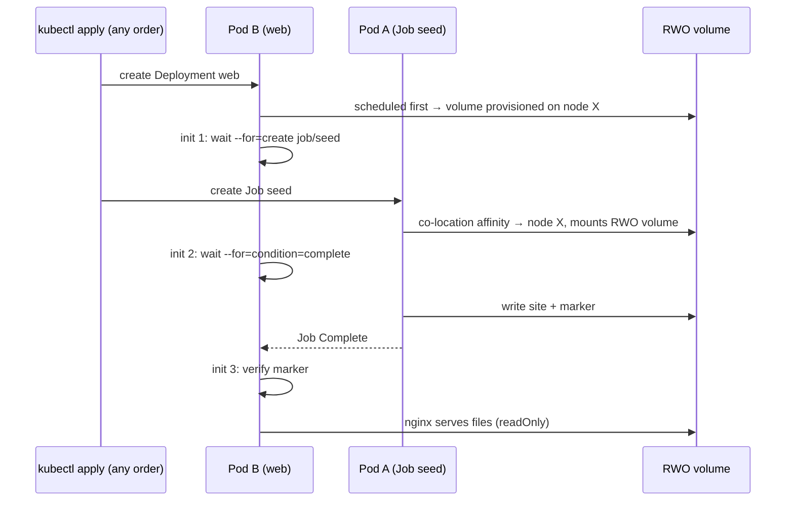
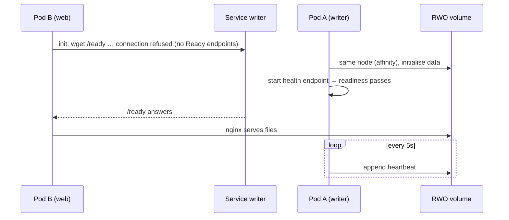
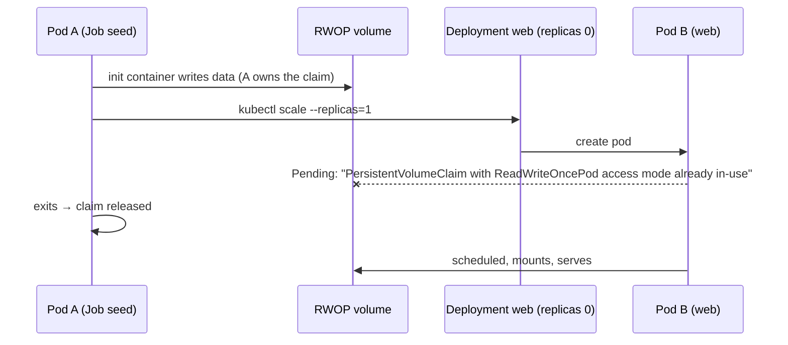

# Scenario: one ReadWriteOnce PVC, two different pods, a specific order

> **Problem.** You have one `PersistentVolumeClaim` with access mode
> `ReadWriteOnce`. Two *different* pods must use it — e.g. pod **A** prepares
> data (migration, seed, download, restore) and pod **B** serves it behind a
> Service — and **B must not start before A**. How do you build that so it
> works every time, whatever order you `kubectl apply` things in?

This folder has four complete, tested solutions, two "broken on purpose"
examples, exercises, and a test script that proves the ordering on a real
cluster.

```bash
./scenarios/rwo-pvc-ordered-pods/test.sh        # all patterns, ~4 min on kind
./scenarios/rwo-pvc-ordered-pods/test.sh 1      # just one
make test-scenario                              # same thing
```

---

## TL;DR

1. **RWO means one *node*, not one *pod*.** Any number of pods on the node the
   volume is attached to can mount it at the same time. So two pods *can*
   share an RWO claim — as long as they are on the same node.
2. **Keep every pod that uses the claim on one node** with a *co-location
   group*: give each such pod the same label and a required pod-affinity to
   that label. The first pod of the group may land anywhere; every other one
   must join it. (Details in [Building block 1](#building-block-1-keep-everything-on-one-node).)
3. **Kubernetes has no `dependsOn`.** You enforce "A before B" yourself. Pick
   the mechanism that matches your situation:

| You want… | Use | Folder |
|---|---|---|
| A runs **once to completion**, then B starts (migration/seed → app) | Job + init containers in B that `kubectl wait` for the Job | [`1-sequential-job-then-app`](1-sequential-job-then-app/README.md) |
| A and B **run at the same time**, B starts only after A is Ready | Two Deployments, B's init container waits for A's Service | [`2-concurrent-ordered-start`](2-concurrent-ordered-start/README.md) |
| Same container image, pod-1 strictly after pod-0, both serving | StatefulSet, `podManagementPolicy: OrderedReady` | [`3-statefulset-ordered`](3-statefulset-ordered/README.md) |
| **Never** two pods on the volume at once (`ReadWriteOncePod`) | A writes, then scales B from 0 → 1 | [`4-rwop-strict-handoff`](4-rwop-strict-handoff/README.md) |

4. Use **`strategy: Recreate`** on every Deployment that mounts the claim.

**Not sure? Use pattern 1** if A is a one-off step, **pattern 2** if A keeps
running. Both work on any storage (local disks or cloud block storage) and
with any apply order.

### The copy-paste version

The two snippets that make pattern 1 work, in any Deployment/Job/StatefulSet:

```yaml
# In BOTH pod templates (A and B): stay on the node that has the volume
metadata:
  labels:
    rwo-group: shared-data
spec:
  affinity:
    podAffinity:
      requiredDuringSchedulingIgnoredDuringExecution:
        - labelSelector:
            matchLabels:
              rwo-group: shared-data
          topologyKey: kubernetes.io/hostname
```

```yaml
# Only in pod B: don't start until Job "seed" (pod A) has completed
spec:
  serviceAccountName: web            # needs get/list/watch on jobs (see 02-rbac.yaml)
  initContainers:
    - name: wait-for-seed-job-created
      image: rancher/kubectl:v1.36.2
      args: ["wait", "--for=create", "job/seed", "--timeout=10m"]
    - name: wait-for-seed-job-complete
      image: rancher/kubectl:v1.36.2
      args: ["wait", "--for=condition=complete", "job/seed", "--timeout=10m"]
```

---

## Background: what the access modes really mean

| Mode | Short | Who can mount it read-write | Typical backends |
|---|---|---|---|
| `ReadWriteOnce` | RWO | pods on **one node** (any number of them) | every block device: AWS EBS, GCE PD, Azure Disk, Ceph RBD, local disks, local-path |
| `ReadOnlyMany` | ROX | many nodes, read-only | NFS, CephFS, some CSI drivers |
| `ReadWriteMany` | RWX | many nodes, read-write | NFS, CephFS, AWS EFS, Azure Files, GCP Filestore, Longhorn RWX |
| `ReadWriteOncePod` | RWOP | **one pod** in the whole cluster | CSI drivers that support it (most current ones); GA since 1.29 |

Two consequences people often miss:

* **Two pods on the same node can share an RWO volume — concurrently.**
  Kubernetes does not stop them. If the application can't cope with two
  writers, use `ReadWriteOncePod` (pattern 4) or make sure only one side
  writes (patterns 1–3 mount it `readOnly` in pod B where possible).
* **Two pods on different nodes cannot.** What you see depends on the storage:

  * **Node-local storage** (kind's `standard`/local-path, minikube hostpath,
    k3s local-path, `local` PVs): the PV has node affinity to the disk's node,
    so the second pod is simply **unschedulable**:
    ```
    0/3 nodes are available: 1 node(s) didn't match PersistentVolume's node affinity, ...
    ```
  * **Network block storage** (EBS, PD, Azure Disk, Ceph RBD, vSphere…): the
    disk can move between nodes but attach to only one at a time. The second
    pod is scheduled, then hangs in `ContainerCreating`:
    ```
    Multi-Attach error for volume "pvc-…" Volume is already used by pod(s) pod-a
    ```

  Reproduce the first one yourself:
  [`broken/01-rwo-pods-on-different-nodes.yaml`](broken/01-rwo-pods-on-different-nodes.yaml).

* **`volumeBindingMode: WaitForFirstConsumer`** (kind's default class, and
  most cloud classes) means the PV is created only when the *first* pod using
  the claim is scheduled, on/near that pod's node. Whoever is scheduled first
  decides where the data lives — which is exactly why co-location has to be
  part of the design, not an afterthought.

---

## Building block 1: keep everything on one node

Every pod that mounts the claim gets:

```yaml
labels:
  rwo-group: shared-data
affinity:
  podAffinity:
    requiredDuringSchedulingIgnoredDuringExecution:
      - labelSelector: { matchLabels: { rwo-group: shared-data } }
        topologyKey: kubernetes.io/hostname
```

Read it as: *"only schedule me on a node that already runs a pod with
`rwo-group=shared-data`"*. That sounds like a chicken-and-egg problem — who
goes first? The scheduler has a rule for exactly this:

> If **no** pod matching the affinity term exists anywhere, and the pod being
> scheduled **matches its own term**, the term is treated as satisfied.

So the first member of the group can go anywhere, and every later member must
follow it. The scheduler places pods one at a time, so even if you create A
and B in the same instant they end up together. Verified on the training
cluster (3 groups of 2 pods created simultaneously):

```
NAME     NODE
aff1-x   kube-training-worker2
aff1-y   kube-training-worker2
aff2-x   kube-training-worker
aff2-y   kube-training-worker
```

Notes:

* Only pods that are **not finished** count. A Completed Job pod no longer
  "holds" the node — the next pod of the group may go anywhere. That's fine:
  a finished pod has released the volume.
* `IgnoredDuringExecution`: already-running pods are not moved. If a node
  dies, replacement pods must join wherever the surviving members are; on
  local storage the PV's node affinity forces them back to the volume's node
  anyway.
* Why not just pin both pods with `nodeSelector`/`nodeName`? You'd be doing
  the scheduler's job by hand, and every node maintenance would need manual
  edits. The group adapts automatically.
* Why not `podAffinity` from B to A only (`app: seed`)? If B is created first
  it would be Pending until A exists — fine — but if A has already
  *completed*, B's affinity can never be satisfied again and B is stuck
  forever. The self-matching group label avoids that.

## Building block 2: enforce the order

Kubernetes reconciles every object independently, so "apply A, then B" in a
YAML file guarantees nothing. Your options:

| Mechanism | How | Pros | Cons |
|---|---|---|---|
| **Init container waits on the API** (pattern 1) | `kubectl wait --for=condition=complete job/seed` | Precise ("A succeeded"); order-independent | Needs a ServiceAccount + Role, a kubectl image |
| **Init container waits on a Service** (pattern 2) | `until wget http://writer:8080/ready; do sleep 2; done` | No RBAC; works for any dependency with a Service | Only expresses "A is Ready", not "A finished" |
| **StatefulSet `OrderedReady`** (pattern 3) | pod-N+1 isn't created until pod-N is Running+Ready | Built-in, nothing to write | One pod template for all pods |
| **A creates/scales B** (pattern 4) | Job's last step: `kubectl scale deploy/web --replicas=1` | B can't exist early → no deadlock with RWOP | GitOps tools fight over `replicas`; needs RBAC |
| **Init container waits on a file** | `until [ -f /data/.done ]` | Simplest | Marker survives restarts → stale "done" after redeploys |
| **Outside the cluster** | CI script with `kubectl wait` ([solution](solutions/apply-in-order.sh)), Helm hooks, Argo CD sync waves | Pods stay simple | Only holds if everyone deploys through that tool; nothing re-checks later |
| **Same pod** | A as an init container (or native sidecar) of B | Strongest guarantee, no affinity needed | Not two pods — but if you *can*, it's the simplest answer |

---

## The four patterns

### Pattern 1 — sequential hand-off: Job → Deployment + Service



Observed on the training cluster (`test.sh 1`, pod B applied *before* pod A):

```
pod B before pod A exists: Init:0/3
PASS web started after the seed Job completed (2026-10-08T10:18:54Z <= 2026-10-08T10:18:57Z)
PASS all pods ran on one node (kube-training-worker)
PASS GET http://web contains 'Hello from the shared RWO volume'
```

→ [Full walkthrough](1-sequential-job-then-app/README.md)

### Pattern 2 — concurrent sharing, ordered start



```
PASS web started after the writer became Ready (2026-10-08T10:19:32Z <= 2026-10-08T10:19:33Z)
PASS GET http://web/heartbeat.txt contains 'heartbeat from writer-'
```

→ [Full walkthrough](2-concurrent-ordered-start/README.md)

### Pattern 3 — StatefulSet with `OrderedReady`

One StatefulSet, 2 replicas, **one** shared PVC in `volumes:` (not
`volumeClaimTemplates`), self-affinity. `app-1` isn't even created until
`app-0` is Ready; pods pick their role from the `apps.kubernetes.io/pod-index`
label.

```
PASS app-1 was created after app-0 became Ready (2026-10-08T10:20:45Z <= 2026-10-08T10:20:54Z)
PASS startup-order.txt lists app-0 then app-1
```

→ [Full walkthrough](3-statefulset-ordered/README.md)

### Pattern 4 — strict `ReadWriteOncePod` hand-off



```
PASS web started after the seed pod released the RWOP claim (2026-10-08T10:21:35Z <= 2026-10-08T10:21:38Z)
PASS scheduler kept web Pending while the seed pod held the claim (FailedScheduling: ReadWriteOncePod)
```

→ [Full walkthrough](4-rwop-strict-handoff/README.md)

---

## Things that go wrong (and how these patterns avoid them)

| Mistake | Symptom | Avoided by |
|---|---|---|
| Pods on different nodes | Pending (`didn't match PersistentVolume's node affinity`) or `Multi-Attach error` | Co-location group affinity |
| `RollingUpdate` on an RWO/RWOP Deployment | New pod on another node can't attach (RWO) or can't schedule at all (RWOP) while the old one waits for it to be Ready → rollout stuck (after `progressDeadlineSeconds` it is only *marked* failed, nothing rolls back) | `strategy: Recreate` |
| RWOP + B waits for A inside B | **Deadlock** if B is scheduled first: B owns the claim, A can never run. See [`broken/02`](broken/02-rwop-init-wait-deadlock.yaml) | Pattern 4: B doesn't exist until A is done |
| `ttlSecondsAfterFinished` on the seed Job | Job is garbage-collected; the next pod B (after a drain or restart) waits forever for a Job that no longer exists | No TTL on the seed Job (or wait on a marker instead) |
| Marker file as the only signal | After a redeploy B sees the *old* marker and starts before the new A finished | Wait on Job status (P1) or readiness (P2); A deletes the marker before it starts (P1) |
| Pod A writes as root, pod B runs as non-root | `Permission denied` in B | Same `runAsUser`, or set `securityContext.fsGroup` so the volume is group-writable |
| Initialiser not idempotent | Restarting pod A later wipes data B is serving | Make init "create if missing" (P3 does this) |

## Production notes

* **Cloud disks are zonal.** With `WaitForFirstConsumer` the disk is created
  in the first pod's zone; all group members follow it there.
* **Node failure.** When a node becomes unreachable, Kubernetes first waits
  (5 minutes by default) before evicting its pods, and then up to another
  6 minutes before force-detaching their volumes — unless you mark the node
  with the `node.kubernetes.io/out-of-service` taint (non-graceful node
  shutdown), which skips the wait. Until then pods can't start elsewhere:
  that's RWO protecting your data from two writers.
* **Needs more than one node?** Then RWO is the wrong tool: use RWX storage
  (NFS/CephFS/EFS/Azure Files/Filestore) and drop the co-location affinity,
  or put the shared state behind a service (a database, object storage).
* **Back up** the volume (VolumeSnapshots, Velero, or a CronJob like
  [`solutions/pattern-2-backup-cronjob.yaml`](solutions/pattern-2-backup-cronjob.yaml)).
* **Real databases** (Postgres, MySQL…) should own their volume alone; use an
  operator rather than sharing their data directory with another pod.

## Exercises

1. **Run the tests**, then run one pattern with `KEEP=1 ./test.sh 2` and poke
   at it: `kubectl -n lab-rwo-concurrent get pods -o wide -w`, `describe`,
   `logs -c wait-for-writer-ready`, `port-forward svc/web 8080:80`.
2. **Break co-location.** Apply [`broken/01`](broken/01-rwo-pods-on-different-nodes.yaml)
   and read the `FailedScheduling` event. Which node holds the PV?
   (`kubectl get pv -o jsonpath='{.items[*].spec.nodeAffinity}'`)
3. **Feel the deadlock.** Follow the comments in
   [`broken/02`](broken/02-rwop-init-wait-deadlock.yaml) (apply 02, then 03).
   Explain why the seed pod is Pending, then fix it by deleting the web
   Deployment. *Hint:* what happens to the claim when the web pod goes away?
4. **Ordering matters.** Recreate pattern 3 with
   `podManagementPolicy: Parallel` (the field is immutable — delete the
   StatefulSet first). *Expected:* `app-1` crashes with `shared data missing -
   the initialiser has not run!` and restarts until `app-0` has finished.
5. **Add a third pod.** Add a backup CronJob to pattern 2 that tars the site
   into the same volume. What must it have so it never lands on another node?
   Solution: [`solutions/pattern-2-backup-cronjob.yaml`](solutions/pattern-2-backup-cronjob.yaml).
6. **Order from outside.** Write a script that deploys pattern 1 in order using
   only `kubectl wait`, and refuses to start pod B if the Job fails.
   Solution: [`solutions/apply-in-order.sh`](solutions/apply-in-order.sh).
7. **Make seed fail.** Change pattern 1's seed command to `exit 1`. What do the
   Job and the web pod show after a few minutes? (`kubectl get job seed`,
   `kubectl get pods`, `kubectl logs deploy/web -c wait-for-seed-job-complete`)

## Cleanup

```bash
kubectl delete namespace lab-rwo-sequential lab-rwo-concurrent lab-rwo-statefulset \
  lab-rwo-rwop lab-rwo-broken lab-rwo-deadlock --ignore-not-found
```

PVs from the default StorageClass use `reclaimPolicy: Delete`, so they are
removed with their claims.

## Further reading

* [Persistent Volumes — access modes](https://kubernetes.io/docs/concepts/storage/persistent-volumes/#access-modes)
* [ReadWriteOncePod access mode graduates to stable](https://kubernetes.io/blog/2023/12/18/read-write-once-pod-access-mode-ga/)
* [Storage classes — volume binding mode](https://kubernetes.io/docs/concepts/storage/storage-classes/#volume-binding-mode)
* [Inter-pod affinity and anti-affinity](https://kubernetes.io/docs/concepts/scheduling-eviction/assign-pod-node/#inter-pod-affinity-and-anti-affinity)
* [Init containers](https://kubernetes.io/docs/concepts/workloads/pods/init-containers/)
* [StatefulSet pod management policies](https://kubernetes.io/docs/concepts/workloads/controllers/statefulset/#pod-management-policies)
* [Non-graceful node shutdown](https://kubernetes.io/docs/concepts/cluster-administration/node-shutdown/#non-graceful-node-shutdown)
* Related modules: [06 Storage](../../modules/06-storage/README.md),
  [07 StatefulSets](../../modules/07-statefulsets/README.md),
  [08 Jobs](../../modules/08-jobs-cronjobs/README.md),
  [10 Scheduling](../../modules/10-scheduling/README.md),
  [11 RBAC](../../modules/11-rbac/README.md)
